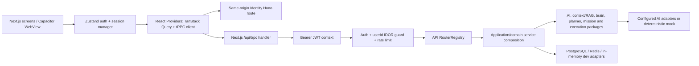

# VedMoulya Repository Audit

- **Audit date:** 2026-10-06
- **Scope:** current repository tree at `D:\VedMoulya`, focusing on shipped app structure, runtime wiring, auth, AI/agent architecture, quality posture, and evidenced gaps. This is a static code/documentation review. No test, lint, typecheck, build, or live-provider command was run as part of this audit.

## Executive assessment

VedMoulya is a TypeScript/npm-workspaces monorepo for a broad life/business execution platform. Its web app is Next.js 15 + React 19; the gateway is tRPC; identity has Hono REST endpoints; PostgreSQL/Drizzle, Redis, provider adapters, and optional OTEL/Prometheus/Grafana form the infrastructure story. The codebase has meaningful architectural safeguards: strict TypeScript, typed inputs, JWT middleware, per-user scoping, bounded mission/agent flows, explicit approvals, mock-vs-live provider status, CI quality gates, and many tests/benchmarks.

The main concern is not a lack of architecture; it is architectural breadth and consistency. There are 49 workspace packages, 9 service workspaces, 49 API router modules, 62 Next page files, and a very large router registry. Multiple generations of concepts (identity, AI orchestration, execution, brain, world model, mission runtime, control plane, experience, and industry UI) coexist. Documentation contains frozen-era counts and statuses that no longer match the live tree. Significant work is uncommitted in the current checkout. The repository says production infrastructure is not provisioned and deployment has not occurred; that is the actual release blocker.

**Audit posture:** strong prototype/platform foundation; not evidence of a deployed, production-operated service. Close the boundary and operational gaps before adding more AI engines.

## 1. Repository and architecture map

### Workspace shape

- Root: npm workspaces (`apps/*`, `packages/*`, `services/*`), TypeScript, Vitest, ESLint, Prettier, scripts for preflight, diagnostics, benchmarks, and release checks.
- Apps: `apps/web` is the only app workspace detected. It hosts the Next.js web/PWA and Capacitor mobile wrapper.
- Services: `api`, `content-agency`, `decision`, `execution`, `identity`, `knowledge`, `memory`, `notifications`, `orchestrator` (9 workspaces).
- Packages: 49 workspaces. Major groups are:
  - Foundation/contracts: `core`, `domain`, `shared`, `information`, `services`, `testing`, `ui`.
  - AI/provider: `ai`, `providers`, `local-ai`, `orchestration-fabric`, `ecosystem`.
  - Knowledge/context/memory: `context`, `context-fabric`, `intelligence-fabric`, `rag`, `knowledge-intelligence`, `memory-intelligence`, `execution-memory`.
  - Planning/execution/agent runtime: `planning`, `goals`, `execution-strategy`, `execution-orchestrator`, `execution-bridge`, `agent-execution`, `adaptive-loop`, `loop-engine`, `mission-controller`, `mission-runtime`.
  - Decision/intelligence: `intelligence`, `enterprise-brain`, `brain`, `os-intelligence`, `learning-intelligence`, `experience-optimization`, `live-intelligence-bridge`, `ai-world`, `ai-world-scheduler`, `world-model`, `proactive`, `control-plane`, `ecosystem-intelligence`.
  - Product/factory/capability: `capabilities`, `capability-marketplace`, `app-factory`, `requirements`, `experience`, `local-workspace`, `execution-*`.

The inventory above is grouped rather than a dependency-complete graph; `package.json` manifests and `scripts/check-dependency-cycles.mjs` are the current source for exact edges. Many new packages use `*` workspace dependencies. This makes local composition straightforward but requires careful release/build ordering and makes package boundaries harder to infer from names alone.

### Runtime request/data flow

The app layer is mostly client-rendered feature pages under Next App Router. `Providers` constructs the tRPC client and query cache, attaches bearer tokens, and refreshes on 401; `AuthBootstrap` restores/validates sessions; `OnboardingRedirect` handles first-login completion; `AppShell` supplies navigation and global UI. The gateway is built lazily on first request through `services/api/src/router.ts`; `RouterRegistry.ts` assembles router procedures and middleware. This is an in-process modular monolith/gateway in the web deployment path, with separately modelled service packages; do not assume each service is independently deployed just because it has a service folder.

## 2. Screens and user-facing routes

The following 62 `page.tsx` routes are present. Route existence does not prove a route is linked in navigation or complete.

| Screen family              | Routes                                                                                                                                                                                                                                                                                                                                                                                                                                                                                                                                                                                                |
| -------------------------- | ----------------------------------------------------------------------------------------------------------------------------------------------------------------------------------------------------------------------------------------------------------------------------------------------------------------------------------------------------------------------------------------------------------------------------------------------------------------------------------------------------------------------------------------------------------------------------------------------------- |
| Entry and account          | `/`, `/login`, `/signup`, `/verify-email`, `/oauth2redirect`, `/onboarding/profile`, `/settings`                                                                                                                                                                                                                                                                                                                                                                                                                                                                                                      |
| Life and personal progress | `/life`, `/progress`, `/goals`, `/learning`, `/career`, `/business`, `/marketplace`                                                                                                                                                                                                                                                                                                                                                                                                                                                                                                                   |
| AI and execution           | `/ai`, `/ai-world`, `/brain`, `/enterprise-brain`, `/execution`, `/execution-strategy`, `/intelligence`, `/learning-intelligence`, `/live-intelligence`, `/loop`, `/missions`, `/os`, `/context`, `/context-fabric`, `/knowledge`, `/memory`, `/providers`, `/capabilities`, `/capability-marketplace`, `/ecosystem`, `/ecosystem-intelligence`, `/applications`, `/autonomous-builder`                                                                                                                                                                                                               |
| Content agency             | `/content-agency`, `/content-agency/analytics`, `/content-agency/brands`, `/content-agency/calendar`, `/content-agency/client-detail`, `/content-agency/clients`, `/content-agency/delivery`, `/content-agency/generator`, `/content-agency/invoices`, `/content-agency/projects`, `/content-agency/review`, `/content-agency/ops`, `/content-agency/ops/contracts`, `/content-agency/ops/crm`, `/content-agency/ops/documents`, `/content-agency/ops/notifications`, `/content-agency/ops/payments`, `/content-agency/ops/portal`, `/content-agency/ops/proposals`, `/content-agency/ops/quotations` |
| Client portal              | `/portal`, `/portal/login`, `/portal/content`, `/portal/deliverables`, `/portal/invoices`                                                                                                                                                                                                                                                                                                                                                                                                                                                                                                             |

Other route handlers include `/api/trpc/[trpc]`, `/api/v1/identity/auth/[...path]`, `/api/metrics`, and health `check`, `live`, `ready` endpoints. Settings has account/profile/security/AI/provider/privacy/data sections; privacy and data explicitly state controls are not implemented. The client portal and agency surfaces are separate product subflows and need their own role/tenant threat model.

## 3. Engines, capabilities, and wiring

### API module surface

There are 49 router modules in `services/api/src/routers` (e.g. dashboard/life OS, career, learning, business, marketplace, identity, content agency/client ops/portal, capabilities/providers, context/context fabric, knowledge/memory/RAG, planning/goals, AI/brain/intelligence, loop, mission, factory/requirements/experience, scheduler/world/proactive/control, voice, search, health/metrics/configuration/notifications). `RouterRegistry.ts` wires the application and procedure methods in one central file of roughly 7,000 lines. It applies common request metrics and constructs protected procedure variants (`standard`, `heavy`, `search`, `auth`) plus public/health variants.

### AI and agent pipeline

The package graph represents a full layered pipeline:

1. Provider capability/runtime registry and provider preferences.
2. Context assembly, knowledge/RAG, memory, retrieval and provenance.
3. Goals/requirements and planning/task graphs.
4. Brain/decision and strategy selection.
5. Bounded loops, mission controller/runtime, tool execution and workspace adapters.
6. Verification, outcomes, learning and experience optimization.
7. AI-world/control-plane opportunity and revenue intelligence.

The repository contains production code, fixture benchmarks, live acceptance scripts, and explicit authorization gates. Provider support should be read from `packages/core/src/startup/provider-runtime.ts` and runtime readiness endpoints, not provider catalog labels: documentation calls OpenAI and DeepSeek executable, while several catalog families are `UNSUPPORTED_RUNTIME`. Live provider or long-horizon success is not implied by deterministic unit/fixture test success; deployment docs state a provider-quality-dependent certification and operator work remains.

### Core architectural strength and cost

Strengths: explicit domain/application/infrastructure organization in several services; provider adapters; same-user gateway guard; bounded retries/loops; approval before consequential actions; mock provider status; Postgres persistence adapters; dependency cycle check; diagnostics and metrics.

Cost: overlapping abstractions and orchestration layers raise cognitive and runtime costs. Package names such as `intelligence`, `enterprise-brain`, `brain`, `os-intelligence`, `intelligence-fabric`, `world-model`, and `control-plane` do not communicate a single source of truth. A roadmap should consolidate ownership/contracts and document actual runtime paths, rather than introduce another agent framework or “engine.”

## 4. Authentication and authorization routes

### Identity REST surface

`services/identity/src/auth/AuthRoutes.ts` is served at `/api/v1/identity/auth/*` through the Next catch-all handler and `apps/web/src/lib/auth-app.ts`.

| Method and route            | Purpose                                             | Auth expectation                                                          |
| --------------------------- | --------------------------------------------------- | ------------------------------------------------------------------------- |
| `POST /sign-up`             | Register; production may require email verification | Public, throttled/validated in service                                    |
| `POST /sign-in`             | Email/password login                                | Public, throttled/validated                                               |
| `POST /verify-email`        | Consume verification token                          | Public, one-time token                                                    |
| `POST /resend-verification` | Resend verification without account enumeration     | Public                                                                    |
| `POST /sign-out`            | Sign out / revoke if configured                     | Bearer/session dependent; inspect implementation for revocation semantics |
| `POST /refresh`             | Exchange refresh token                              | Refresh token body; rotates according to service behavior                 |
| `GET /google/url`           | Start OAuth and issue CSRF state                    | Public                                                                    |
| `GET /google/callback`      | Validate state and exchange code                    | Public callback with one-time state                                       |
| `GET /me`                   | Current profile                                     | Bearer protected                                                          |
| `PATCH /me/profile`         | Update current profile                              | Bearer protected                                                          |
| `GET /session`              | Verify access token/session                         | Bearer protected                                                          |
| `GET /health`               | Auth service liveness                               | Public                                                                    |

The identity domain also exposes user/admin REST and tRPC operations under `presentation/routes` and `presentation/trpc`; those must be reviewed separately for role/ownership policy before external exposure. Google OAuth state is persisted/hashed through an adapter. Signup verification tokens also have dedicated store/sender interfaces. Auth client code is in `apps/web/src/auth/auth-api.ts`; refresh, session bootstrap, offline restoration, logout, and profile state are in `session-manager.ts` and the Zustand store.

### Gateway authorization

The tRPC context verifies a Bearer JWT using `jose` with issuer `vedmoulya`, audience `vedmoulya-api`, and `type=access`. Standard/heavy/search/auth procedures run auth middleware and compare any root `userId` input with the verified session ID to mitigate IDOR. Rate limiting is production-only in the shown middleware, and development/test uses an in-memory/no-distributed-safety setup. Public and health procedure variants intentionally omit the same auth middleware. Every router procedure should be inventoried and classified against an explicit public/protected policy; the central registry and 49 routers make broad regex review insufficient.

### Authentication risks/gaps to validate

- Web access and refresh tokens are persisted in `localStorage` through Zustand (`apps/web/src/auth/secure-store.ts`); this is XSS-readable. Native Capacitor uses platform secure storage. Prefer a same-site, HttpOnly refresh cookie/BFF design for browsers, with short-lived access tokens held in memory, CSRF controls, and explicit rotation/reuse detection.
- `TRPCContext` currently has no tenant/organization claims. Same-user ID checking prevents a common IDOR shape, but is not a complete tenant authorization model or per-resource ownership check.
- A root-field `userId` check cannot detect nested owner IDs, alternate resource IDs, batch semantics, or authorization hidden inside adapter/service paths. Verify all mutation/read paths enforce owner/tenant access at the data boundary.
- Confirm refresh-token persistence, rotation, replay detection, revocation, sign-out invalidation, concurrent refresh behavior, password reset/change, MFA/passkeys, device/session management, and account deletion. The visible web settings explicitly lack export/deletion and privacy APIs.
- Confirm OAuth redirect allowlists, `state` single-use/TTL, PKCE where applicable, callback open-redirect handling, origin/CORS allowlists, and cookie SameSite/Secure behavior in deployed environments.
- Verify static mobile builds do not accidentally expose server handlers/config and that the remote gateway URL is required and checked.

## 5. Blockers and gaps

### Release blockers (confirmed by repository documentation)

`docs/ops/DEPLOYMENT_GUIDE.md` states infrastructure is **not provisioned**, deployment has **not occurred**, and production verification cannot be assessed. External prerequisites include Vercel project/token/IDs, PostgreSQL, Redis, AI credential, JWT secret, production CORS/domain/TLS, and SMTP. Thus this repo cannot be called live production based on CI or local certification.

### Engineering gaps (confirmed or strongly evidenced)

1. **Repository state reproducibility:** current tree has many modified tracked files and newly untracked code/tests (including identity OAuth state and opportunity intelligence); there are also untracked `_live*`, `_s*`, and `_real08` directories. They are not tracked by Git. The audit intentionally did not clean, stash, or alter these. Establish which changes are active product work and commit/ignore/archive them deliberately.
2. **Documentation drift:** root `README.md`, `REPOSITORY.md`, `CURRENT_STATE.md`, `FEATURE_MATRIX.md`, and `IMPLEMENTATION_STATUS.md` contain different architecture counts, product states, and claims. Example: README still describes 12 services/10 packages, while manifests show 9 service workspaces/49 packages. `CURRENT_STATE.md` is dated 2026-08-07 and says v1 frozen, while implementation/deployment docs describe later EPICs and September release work. Make one generated current-state inventory authoritative.
3. **False confidence from certification:** extensive deterministic benchmarks are valuable but do not prove live model quality, operational availability, security posture, or production traffic. Deployment guide itself records a provider-quality-dependent run variance and no deployment.
4. **Central change bottleneck:** `RouterRegistry.ts` is a multi-thousand-line routing/composition hub. Split it by bounded context and generate a typed router tree, while preserving compile-time API contracts and middleware invariants.
5. **Privacy/data lifecycle:** user-facing settings document privacy/export/retention/deletion as missing; no self-service data export/deletion route is exposed. Data minimization, retention, and deletion are foundational product/legal engineering work.
6. **Authentication storage:** browser localStorage holds both access and refresh JWTs. Move refresh credentials to HttpOnly Secure SameSite cookies or a server-side session/BFF and add CSP/XSS controls as a defense-in-depth package.
7. **Authorization classification:** gateway public routes are intentional, but the number of procedures and routers makes accidental public registration or incomplete owner checks plausible. Need a machine-readable policy inventory + tests that fail when a non-health procedure is public without documented reason.
8. **Service deployment ambiguity:** folders are called services, but deployment topology is principally a Next app/gateway in this repo. Document whether deployable independently, runtime boundaries, scaling, migration ownership, and failure isolation.
9. **CI/deployment maturity:** CI has broad checks and dependency scanning; production still needs provisioning, secrets setup, deploy, migrations/rollback, backups/restore rehearsal, alerting/on-call, incident process, and live smoke/canary validation.
10. **Docs placeholders:** `apps/README.md`, `packages/README.md`, and some package/service READMEs remain TODO/template-level, including `services/orchestrator/README.md` describing future work despite actual engine packages. Document the real runtime contract or remove stale scaffolding.

## 6. Prioritized fixes

### P0 — before production data or users

1. Provision a staging environment first; then deploy production only after smoke tests, migration rollback, backup restore, email delivery, AI quota/rate behavior, and runbooks are demonstrated.
2. Move browser refresh tokens out of localStorage; implement refresh rotation/reuse detection and verify logout/revocation. Add CSP and security headers.
3. Audit every public tRPC and REST endpoint; require an explicit allowlist, tenant/resource ownership checks, and route-level negative tests for unauthenticated/cross-user access.
4. Deliver privacy/data lifecycle APIs: export, account deletion, retention policy, consent/provider disclosure, and downstream deletion semantics for identity, memory, knowledge, RAG, logs, and backups.
5. Enforce distributed rate limits in production and test multi-instance behavior; document per-route limits and abuse monitoring.

### P1 — reduce operational and AI risk

6. Create an architecture ownership map: package owner, authoritative contracts, runtime callers, data store, maturity (implemented/fixture-only/live), autonomy/approval level. Mark dead/experimental packages.
7. Break up `RouterRegistry.ts`; use vertical router factories and a single application composition root. Preserve shared middleware and generated contract tests.
8. Introduce trace IDs across browser → tRPC/REST → provider → tool → persistence. Emit redacted structured events with provider/model/version, prompt/template version, tool calls, latency, cost/tokens, retries, refusal, grounding evidence, and user approval state.
9. Build versioned golden datasets and task-level evals for each important flow (auth, retrieval, opportunity/value scoring, mission completion, generated artifacts). Track quality, safety, latency and cost distributions; gate releases on regressions.
10. Separate deterministic unit/contract tests, hermetic model fixtures, and real-provider acceptance runs. Avoid labelling fixture success as live capability.
11. Use migrations and schema ownership per bounded context; add restore and migration compatibility drills. State which persistence adapter is used in every deployment mode.

### P2 — product focus and maintainability

12. Pick a small number of high-value end-to-end journeys and make their screen → API → domain → persistence → outcome path observable and reliable before expanding feature surface.
13. Consolidate overlapping intelligence/orchestration concepts with ADRs and deprecation paths; a new framework is not currently the highest-value investment.
14. Generate route/package/service inventories and docs from manifests so README/state claims stay synchronized.
15. Add navigation discoverability, role-aware screen maps, accessibility evidence, and route-level empty/error/loading state audits to the product release checklist.

## 7. Current AI engineering recommendations

“Most advanced” should mean the simplest system that meets measured quality, latency, safety, and cost targets. Current primary-source guidance emphasizes composable workflows, robust tool interfaces, managed/isolated execution for long tasks, and evaluation—not maximum agent count or framework count. Anthropic explicitly distinguishes predictable workflows from dynamic agents and recommends adding complexity only when simpler systems fail; tool docs and evaluations are central to agent reliability ([Building effective agents](https://www.anthropic.com/engineering/building-effective-agents), [Writing effective tools for agents](https://www.anthropic.com/engineering/writing-tools-for-agents)).

Recommended AI roadmap for this repo:

- Keep ordinary app features deterministic; call a model only where language or uncertainty adds user value.
- Constrain agent loops with explicit typed inputs/outputs, step/time/token/cost budgets, tool allowlists, idempotency keys, durable checkpoints, cancellation, and approval gates. The mission runtime already offers useful primitives; consolidate around them.
- Treat tools as product APIs for models: small verbs, clear preconditions, bounded payloads, typed results, stable errors, least privilege, and negative tests. Keep privileged operations behind application policy checks, never prompt text.
- Make retrieval hybrid and evidence-bearing: tenant-filter first, permission-filter every retrieval, cite source/provenance/freshness, evaluate retrieval separately from generation, and expose “insufficient evidence” honestly. Retrieve additional context just-in-time rather than stuffing large memories into every call ([Effective context engineering](https://www.anthropic.com/engineering/effective-context-engineering-for-ai-agents)).
- Use evaluation as release infrastructure: curated task datasets, tool-choice/argument checks, outcome assertions, safety/authorization tests, regression comparisons across model/provider/prompt versions, and sampled production review. Agents are multi-turn state-changing systems, so evaluate full traces and outcomes, not just final text ([Demystifying evals for AI agents](https://www.anthropic.com/engineering/demystifying-evals-for-ai-agents), [OpenAI Evals API](https://platform.openai.com/docs/api-reference/evals)).
- Add an interoperable tool connector layer only where external integrations warrant it. MCP is a reasonable emerging standard, but implement a versioned allowlisted adapter and security review; do not turn every internal function into an externally callable tool. Track the current spec and auth requirements ([MCP specification updates](https://blog.modelcontextprotocol.io/posts/2026-07-28/)).
- Use isolated sandboxes for generated code and computer-use capabilities; separate planner (“brain”) from credentials, filesystem/network authority (“hands”), and enforce resource/network quotas. Keep human approval for payments, publishing, account changes, external communication, and irreversible operations.
- Maintain provider-agnostic interfaces while tracking quality per task. Route by capability/quality/privacy/cost/latency and record the decision. Avoid selecting providers from catalog metadata when an adapter is not actually executable.

## 8. Audit inventory and limitations

- Static counts from current worktree: 62 page files, 49 API router modules, 49 package workspaces, 9 service workspaces, and 965 test/spec files matched by filename under `apps`, `services`, `packages`, and `tests`. These are inventory counts, not coverage or pass results.
- Key evidence read: `package.json`, workspace manifests, `apps/web/src/app`, `apps/web/src/auth`, `apps/web/src/components/Providers.tsx`, `services/api/src/services/RouterRegistry.ts`, `services/api/src/middleware/auth.ts`, `services/identity/src/auth/AuthRoutes.ts`, deployment guide, CI workflow, and settings privacy/data surfaces.
- The checkout has local, uncommitted edits. Findings describe the visible working tree and should be revalidated against the intended release commit.
- This report does not claim penetration-test coverage, full procedure-by-procedure authorization verification, current CI pass status, runtime uptime, live provider behavior, database migration safety, or production security certification.
