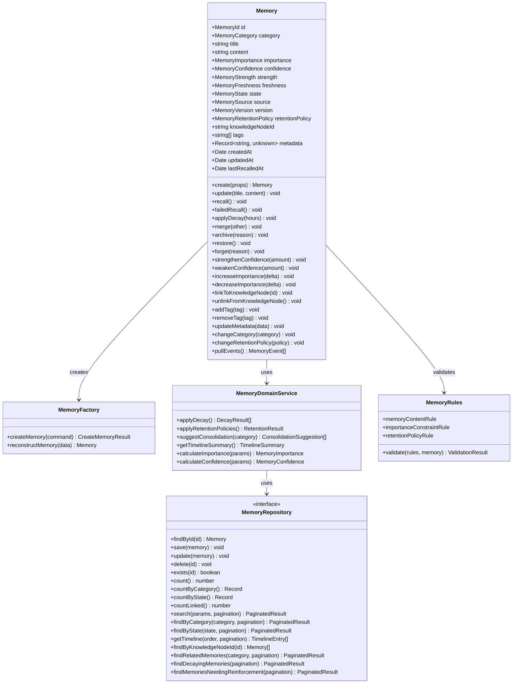
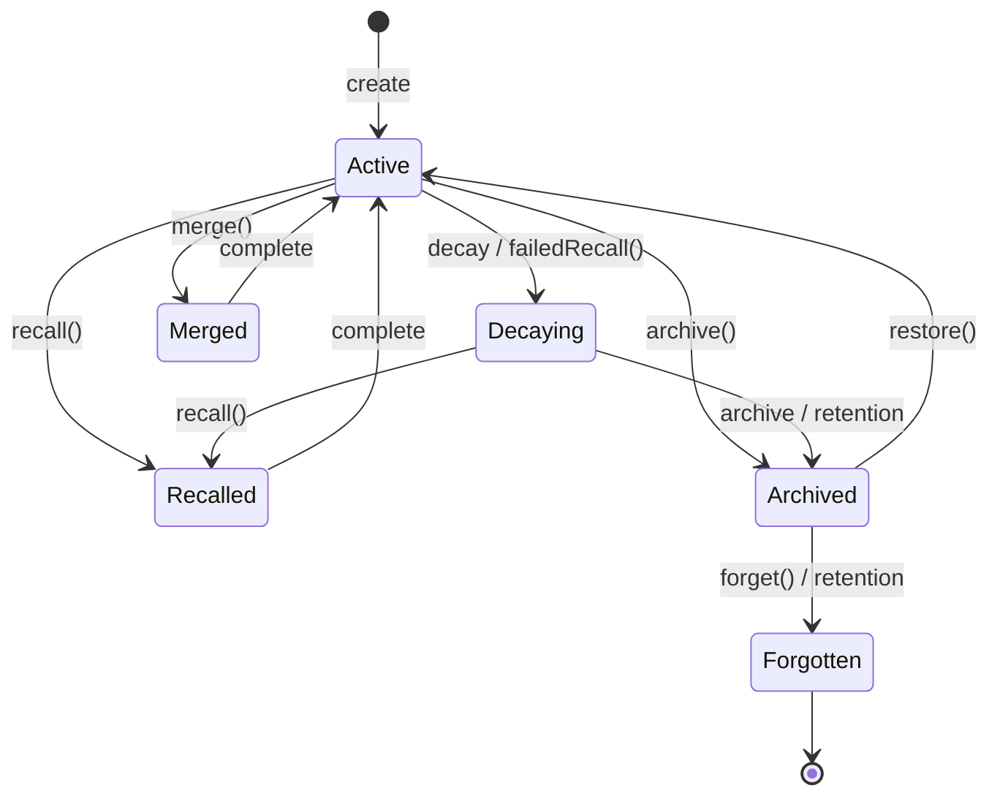
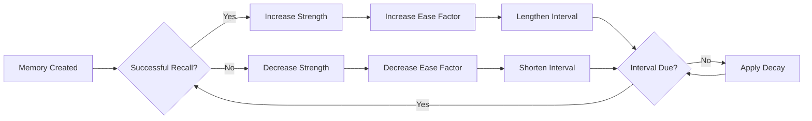
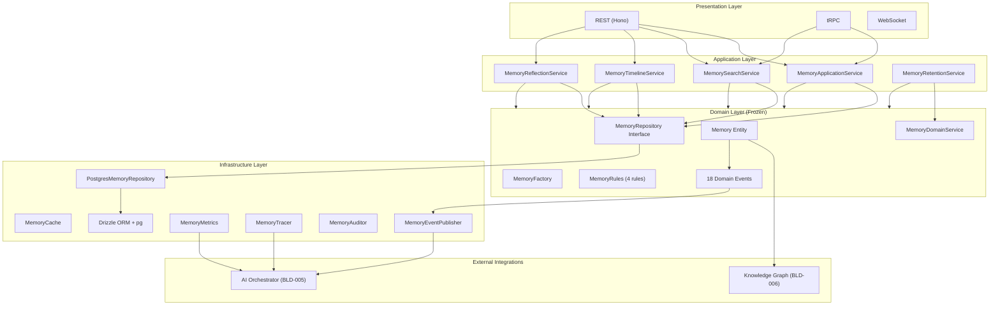
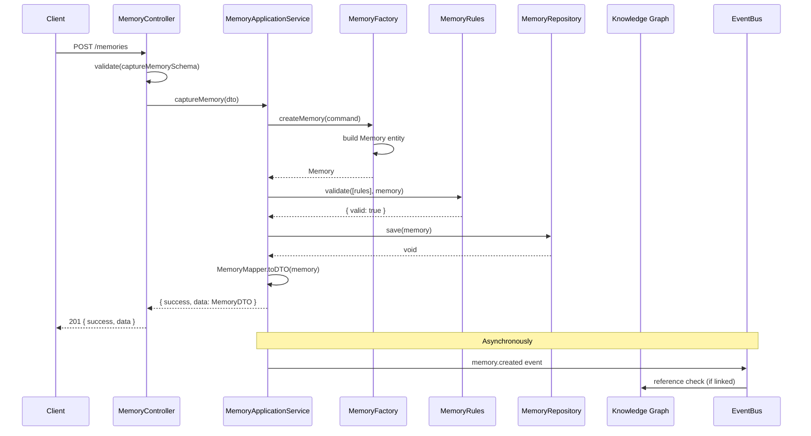
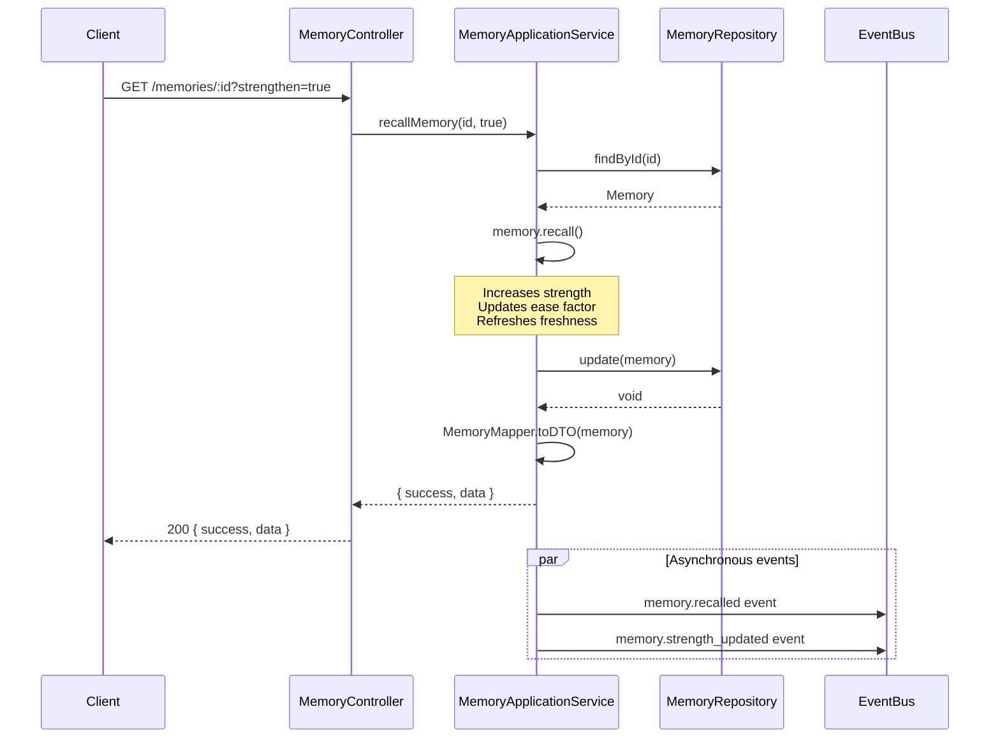
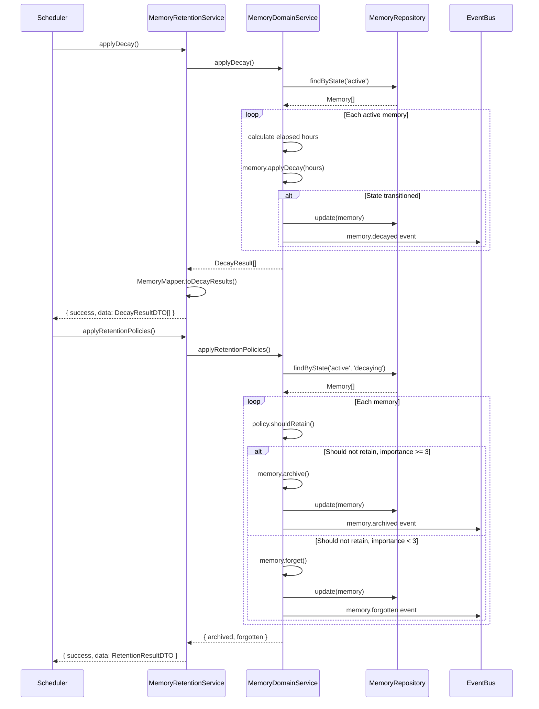
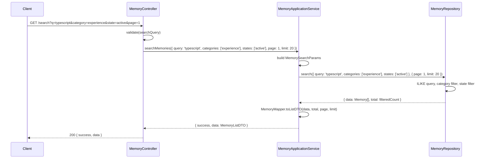
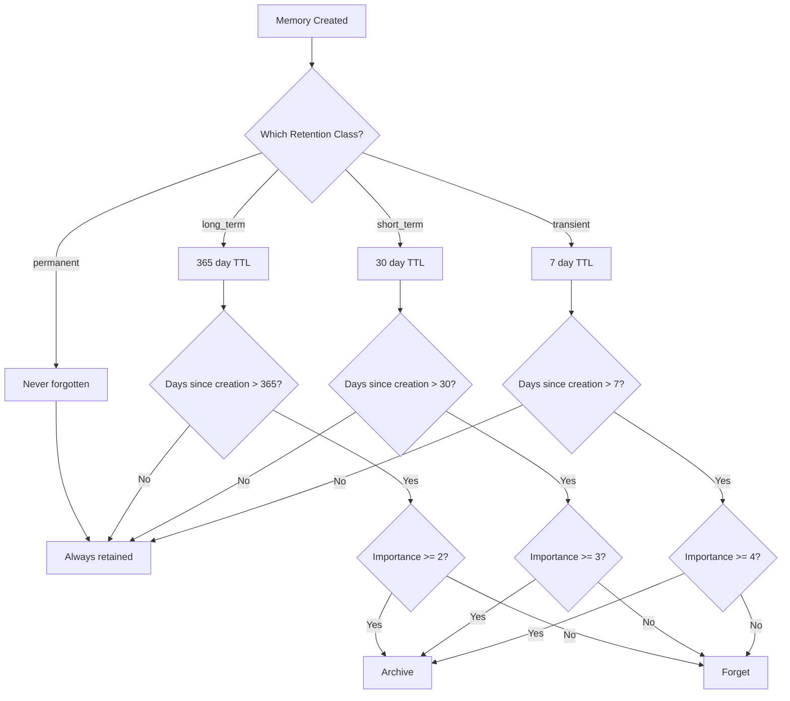
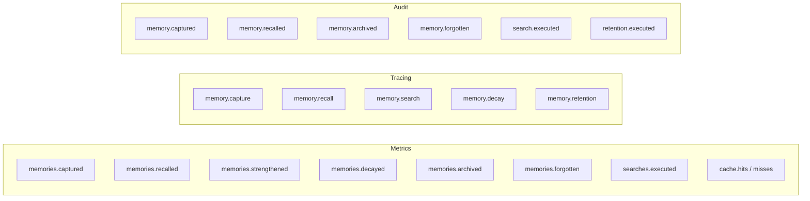

# Memory Engine Architecture

## Overview

The Memory Engine implements a cognitive memory system for VedMoulya. It models how human-like memories are captured, strengthened through recall, decay over time, and eventually archived or forgotten.

## Domain Model

## Memory Lifecycle

## Spaced Repetition Algorithm

## Application Layer Architecture

## Sequence Diagrams

### Capture Memory

### Recall and Spaced Repetition

### Memory Decay and Retention

### Search with Filters

## Retention Policy Decision Flow

## Observability

## Extension Guide

### Adding a New Memory Category

1. Add the category to `packages/domain/src/memory/value-objects/MemoryCategory.ts`
2. Add to the Zod schema in `services/memory/src/presentation/validation/MemorySchemas.ts`
3. Add mapper support if needed

### Adding a New Memory Operation

1. Add entity method in `packages/domain/src/memory/entities/Memory.ts`
2. Add domain event in `packages/domain/src/memory/events/MemoryEvent.ts`
3. Add application service method in `packages/services/src/memory/MemoryApplicationService.ts`
4. Add REST endpoint in `services/memory/src/presentation/controllers/MemoryController.ts`
5. Add tRPC procedure in `services/memory/src/presentation/trpc/MemoryRouter.ts`
6. Add metrics in `services/memory/src/observability/MemoryMetrics.ts`
7. Add audit in `services/memory/src/observability/MemoryAudit.ts`

### Adding a New Retention Policy

1. Add class to `packages/domain/src/memory/value-objects/MemoryRetentionPolicy.ts`
2. Add to the Zod schema's `retentionClass` enum
3. Update database migration if needed
